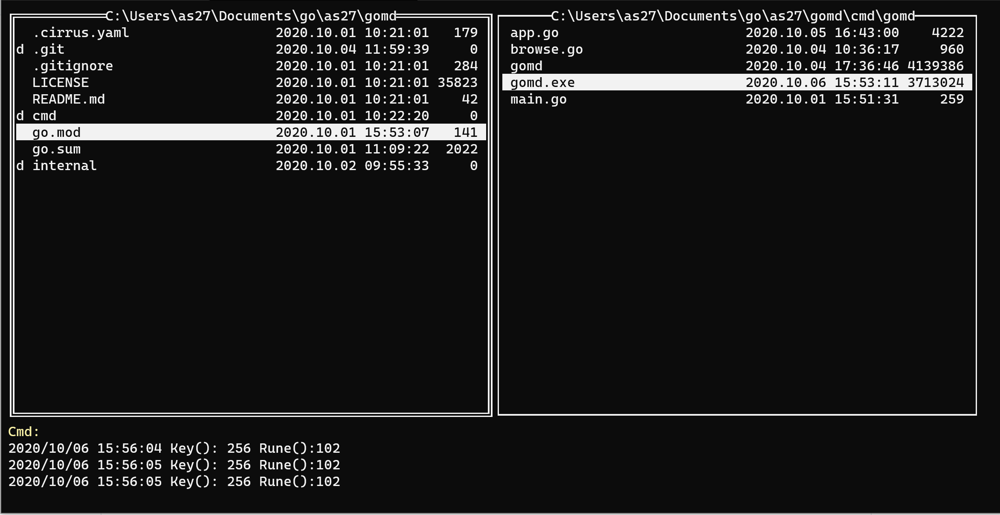

# gomd

Prototype for a file browser for the command line. The idea behind this project is to use tview and create something usefull and get some people envolved for the hacktoberfest. 

The logic of gomd is to have two filebrowsers (left and right). That idea is not new (look for example for the midnight commander).

The navigation inside the file browsers are a little bit like in vim. For going down with the selection you should use the key under your index finger. 

At the moment the navigation uses a simple logik:

* index-finger navigates down
    * f: navigates down for the left side
    * j: navigates down for the right side
* middle-finger navigates up
    * d: navigates up for the left side
    * k: navigates up for the right side
* ring-finger goes one folder up
    * s: one folder up left
    * l: one folder up right
* the keys in the middle let you navigate inside a folder
    * g: for the left side
    * h: for the right side